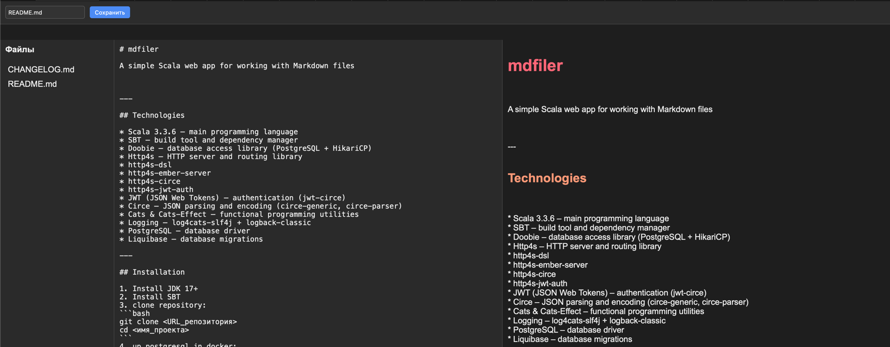

# mdfiler

A simple Scala web app for working with Markdown files



---

## Technologies

* Scala 3.3.6 – main programming language
* SBT – build tool and dependency manager
* Doobie – database access library (PostgreSQL + HikariCP)
* Http4s – HTTP server and routing library
* http4s-dsl
* http4s-ember-server
* http4s-circe
* http4s-jwt-auth
* JWT (JSON Web Tokens) – authentication (jwt-circe)
* Circe – JSON parsing and encoding (circe-generic, circe-parser)
* Cats & Cats-Effect – functional programming utilities
* Logging – log4cats-slf4j + logback-classic
* PostgreSQL – database driver
* Liquibase – database migrations

---

## Installation

1. Install JDK 17+
2. Install SBT
3. clone repository:
```bash
git clone <URL_репозитория>
cd <имя_проекта>
```
4. up postgresql in docker:
```bash
cd docker
docker compose up
```
4. sbt run
